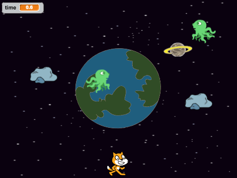

## Introduction

Help the Scratch mascot avoid the space junk and return safely back to Earth!

  <iframe allowtransparency="true" width="485" height="402" src="https://scratch.mit.edu/projects/embed/59295958/?autostart=false" frameborder="0"></iframe>
  

### Additional information for club leaders

If you need to print this project, please use the [Printer friendly version](https://projects.raspberry-pi.org/en/projects/space-junk/print).

--- collapse ---
---
title: Club leader notes
---

## Introduction:
In this project, children will learn how to use loops, decisions and variables to create a simple game.

## Resources
For this project, Scratch 2 should be used. Scratch 2 can either be used <a href="http://scratch.mit.edu/projects/editor/">online</a> or <a href="http://scratch.mit.edu/scratch2download/">offline</a>.

You can find a completed version of this project <a href="http://scratch.mit.edu/projects/59295958/#editor">online</a>, or it can be downloaded by clicking the 'Project Materials' link for this project, which contains:

+ SpaceJunk.sb2

## Learning Objectives
+ This project includes the use of:
	+ loops;
	+ decisions;
	+ variables;
	+ relational (`>`) operator;
	+ coordinates.

This project covers elements from the following strands of the [Raspberry Pi Digital Making Curriculum](http://rpf.io/curriculum):

+ [Combine programming constructs to solve a problem.](https://www.raspberrypi.org/curriculum/programming/builder)

## Challenges
+ "More movement" - consolidating learning of input events and coordinates;
+ "Changing your planet’s orbit" - using `motion`{:class="blockmotion"} blocks to change sprite behaviour;
+ "More space junk" - sprite motion consolidation task;
+ "2 players" - using more input events to improve gameplay.

--- /collapse ---

--- collapse ---
---
title: Project materials
---

## Club leader resources
* [Online completed Scratch 2 project](http://scratch.mit.edu/projects/59295958/#editor)
* [Downloadable completed Scratch 2 project](resources/SpaceJunk.sb2)

--- /collapse ---