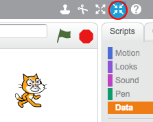
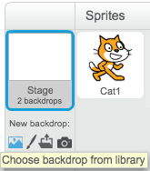
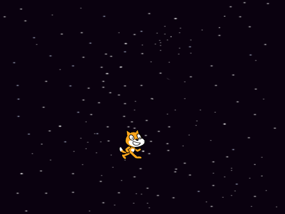
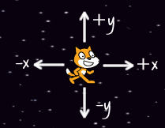

## Controlling the cat

Let's allow the player to control the cat with the arrow keys.


+ Start a new Scratch project. You can find the online Scratch editor at <a href="http://jumpto.cc/scratch-new" target="_blank">jumpto.cc/scratch-new</a>.

+ Click the 'Shrink' button and then click on the cat a few times to make it a little smaller.

	

+ To add a background, click 'Choose backdrop from library' and select the 'Stars' backdrop.

	

	This is how your stage should look:

	

+ Let's move the cat to the left when the left arrow key is pressed. 

	Click on your cat sprite, and add the following code:

	```scratch
	when [left arrow v] key pressed?
	change x by (-10)
	```

	Notice that you need to change the x coordinate to move the cat to the left.

	

+ Test out your cat by pressing the left arrow key. You should see your cat move towards the left of the stage.

+ To move the cat upwards when the up arrow key is pressed, you'll need to add some more code:

	```scratch
	when [up arrow v] key pressed?
	change y by (10)
	```

+ Test your project again to make sure that your new code works!


