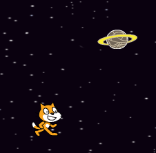

## Space junk!

Let's add some space junk for the cat to avoid.


+ Click 'Add new sprite from library' and add the 'Planet2' sprite to your stage. You can change the size of the planet if you want to.

	

+ Add this code to make the planet move around the stage forever:

	```blocks
	when flag clicked
	forever
		move (2) steps
		if on edge, bounce
	end
	```

+ Click the green flag to test our your new planet. It should move left and right across the stage.

	Have you noticed that your planet turns upside-down (rotates) when it hits the edge of the screen? To fix this, just add this code to your planet sprite:

	```scratch
	set rotation style [don't rotate v]
	```

+ The game should end when the planet touches the cat, so let's add this code __inside__ the planet's `forever`{:class="blockcontrol"} loop:

	```scratch
	if <touching [Cat1 v]?> then
		stop [all v]
	end
	```

	Here's how your planet's code should look:

	```scratch
	when flag clicked
	forever
		move (2) steps
		if on edge, bounce
		if <touching [Cat1 v]?> then
			stop [all v]
		end
	end
	```

+ Test your game again - does the game end when the planet hits the cat?


