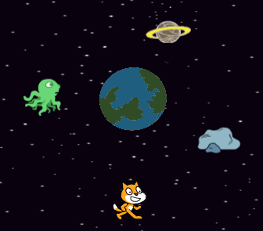
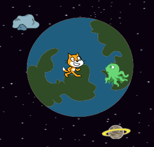
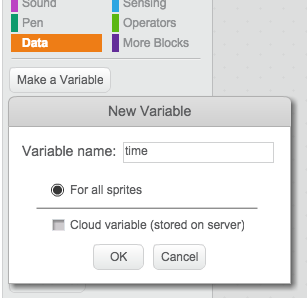
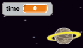

## Getting back to Earth

Can you avoid the space junk for 30 seconds, and get back to Earth safely?


+ Firstly, let's add the Earth sprite to the center of your stage.

	

+ Add this code to your Earth sprite, so that it starts off very small and slowly get's bigger and bigger:

	```blocks
	when flag clicked
	set size to (10) %
	forever
		change size by (0.3)
	end
	```

+ Test out your Earth sprite. It should look as if your cat is slowly floating towards Earth!

	

+ Click on your stage, and create a new variable to store the time.

	

	You should now see your timer in the top-left of the stage.

	

+ Add this code to your stage, so that the timer counts up forever:

	```blocks
	when flag clicked
	forever
		wait (0.1) secs
		change [time v] by (0.1)
	end
	```

+ Click the green flag and you should see your timer start to count up!

	

+ The game is won if the cat can avoid the space junk for 30 seconds.

	For this to work, you just need to set your timer to 0 at the start of the game, and then wait until the timer gets to 30.

	Click on your cat sprite, and add this script:

	```blocks
	when flag clicked
	set [time v] to [0]
	wait until <(time) > [30]>
	say [I made it!] for (2) secs
	stop [all v]
	```


