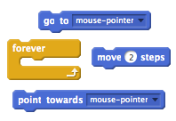

--- challenge ---
## Challenge: 2 players
Can you improve your game, so that one of your enemy sprites is controlled by another player? They could use the w, a, s and d keys to control the enemy.

You could even let one of your players use the mouse to control their character. Here are some blocks that may help you:

--- /challenge ---